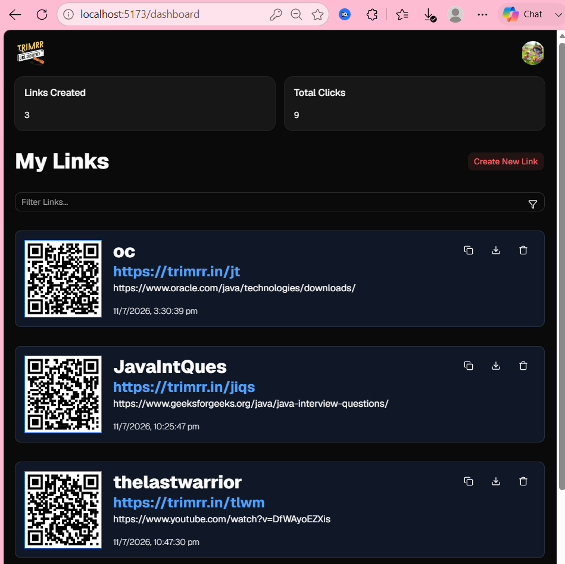
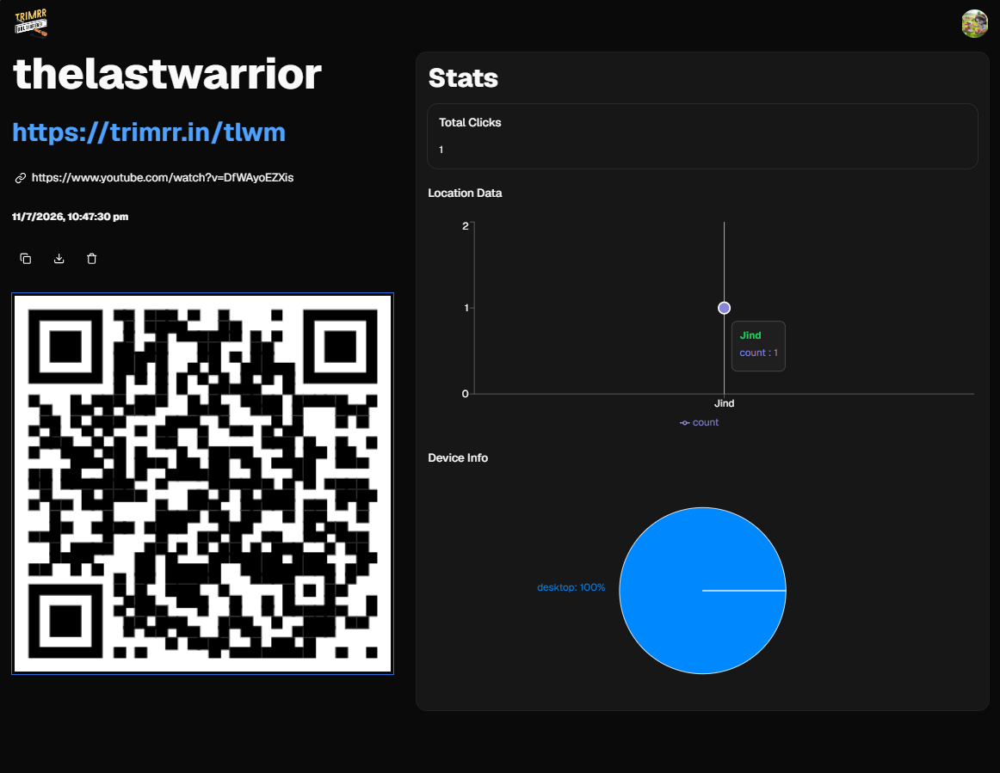

# 🔗 URL Shortener & Analytics Platform

A modern full-stack URL Shortener and Analytics Platform that allows users to create, manage, and monitor short links through an intuitive dashboard.

The platform provides detailed analytics for shortened URLs, including click activity, device statistics, and geographical information, helping users understand how their links are being accessed.

---

## 🚀 Features

### 🔐 Authentication

- User Sign Up and Login
- Protected routes for authenticated users
- Persistent authentication using Supabase
- Secure user-specific URL management

### 🔗 URL Shortening

- Convert long URLs into custom short, shareable links
- Automatically generate QR codes for shortened URLs
- Download and share generated QR codes
- Redirect users from short URLs to their original destination
- Copy shortened URLs easily
- Manage multiple shortened links

### 📊 Analytics Dashboard

- Track total clicks on shortened URLs
- View link performance through an interactive dashboard
- Monitor device statistics
- Analyze geographical/location-based traffic
- View analytics for individual shortened links

### 📱 Responsive UI

- Responsive design for desktop, tablet, and mobile devices
- Clean and modern user interface
- Reusable UI components
- Interactive dialogs, cards, tabs, and dropdown menus

---

## 🛠️ Tech Stack

### Frontend

- **React.js** – Component-based UI development
- **JavaScript (ES6+)** – Application logic
- **Tailwind CSS** – Styling and responsive design
- **Shadcn UI** – Reusable and accessible UI components
- **Vite** – Fast development and build tooling

### Backend / Database

- **Supabase** – Backend-as-a-Service and authentication
- **PostgreSQL** – Relational database for storing users, URLs, and click analytics

### Development Tools

- **Git & GitHub** – Version control and source code management
- **VS Code** – Development environment
- **ESLint** – Code quality and linting

---

## 🏗️ Project Architecture

The application follows a modular React architecture where UI components, pages, API/database operations, authentication, layouts, and reusable hooks are separated into dedicated modules.

```text
URL Shortener/
│
├── public/
│   └── Static assets
│
├── src/
│   │
│   ├── assets/
│   │   ├── hero.png
│   │   ├── react.svg
│   │   └── vite.svg
│   │
│   ├── components/
│   │   ├── ui/
│   │   │   ├── accordion.jsx
│   │   │   ├── avatar.jsx
│   │   │   ├── button.jsx
│   │   │   ├── card.jsx
│   │   │   ├── dialog.jsx
│   │   │   ├── dropdown-menu.jsx
│   │   │   ├── input.jsx
│   │   │   └── tabs.jsx
│   │   │
│   │   ├── Create-Link.jsx
│   │   ├── Device-Stats.jsx
│   │   ├── Error.jsx
│   │   ├── Header.jsx
│   │   ├── Link-Card.jsx
│   │   ├── Location-Stats.jsx
│   │   ├── Login.jsx
│   │   ├── Require-Auth.jsx
│   │   └── Signup.jsx
│   │
│   ├── db/
│   │   ├── ApiAuth.js
│   │   ├── ApiClicks.js
│   │   ├── ApiUrls.js
│   │   └── supabase.js
│   │
│   ├── hooks/
│   │   └── use-fetch.jsx
│   │
│   ├── layouts/
│   │   └── AppLayout.jsx
│   │
│   ├── lib/
│   │   └── utils.js
│   │
│   ├── pages/
│   │   ├── Auth.jsx
│   │   ├── Dashboard.jsx
│   │   ├── LandingPage.jsx
│   │   ├── LinkPage.jsx
│   │   └── RedirectLink.jsx
│   │
│   ├── App.css
│   ├── App.jsx
│   ├── context.jsx
│   ├── index.css
│   └── main.jsx
│
├── .gitignore
├── components.json
├── eslint.config.js
├── index.html
├── jsconfig.json
├── package.json
├── package-lock.json
├── tailwind.config.js
├── vite.config.js
└── README.md
```

---

## 🔄 Application Flow

```text
                 User
                  │
                  ▼
           ┌─────────────┐
           │   React UI  │
           └──────┬──────┘
                  │
          ┌───────┴────────┐
          ▼                ▼
   Authentication      URL Management
          │                │
          └───────┬────────┘
                  ▼
              Supabase
                  │
                  ▼
             PostgreSQL
                  │
                  ▼
          Click Analytics
          ┌───────┴─────────┐
          ▼                 ▼
    Device Statistics   Location Statistics
```

---

## 📊 Analytics

One of the main features of the application is its analytics dashboard.

For each shortened URL, users can monitor:

- Total number of clicks
- Device information
- Location-based traffic
- Link-specific performance

This allows users to understand how their links are being used rather than simply shortening URLs.

---

## 🔑 Environment Variables

The application uses environment variables for configuration and sensitive credentials.

Create a `.env` file in the project root:

```env
VITE_SUPABASE_URL=your_supabase_project_url
VITE_SUPABASE_ANON_KEY=your_supabase_anon_key
```

> ⚠️ Never commit your `.env` file or other sensitive credentials to GitHub.

Make sure `.env` is included in `.gitignore`.

---

## ⚙️ Installation & Setup

### 1. Clone the Repository

Clone the repository from GitHub:

```bash
git clone YOUR_GITHUB_REPOSITORY_URL
```

Then navigate into the project:

```bash
cd url-shortener
```

### 2. Install Dependencies

```bash
npm install
```

### 3. Configure Environment Variables

Create a `.env` file in the root directory and add your Supabase configuration:

```env
VITE_SUPABASE_URL=your_supabase_project_url
VITE_SUPABASE_ANON_KEY=your_supabase_anon_key
```

### 4. Start the Development Server

```bash
npm run dev
```

The application will then be available through the local development URL provided by Vite.

---

## 📦 Available Scripts

| Command           | Description                   |
| ----------------- | ----------------------------- |
| `npm run dev`     | Starts the development server |
| `npm run build`   | Creates a production build    |
| `npm run preview` | Previews the production build |
| `npm run lint`    | Runs ESLint                   |

---

## 🖥️ Application Screens

### Landing Page

The landing page introduces the URL shortening platform and provides access to authentication and the application's main functionality.

### Authentication

Users can create an account and log in to access their personal URL dashboard.

### Dashboard

The dashboard allows authenticated users to create and manage their shortened URLs.

### Link Analytics

Individual links provide detailed performance information, including click activity, device statistics, and location-based analytics.

---

## 📸 Screenshots

Add screenshots of your application here.

### Landing Page

```text
 
```

### Dashboard

```text
 
``` 

### Link Analytics

```text
 
``` 

---

## 🎯 Key Learning Outcomes

Through this project, I worked with and strengthened my understanding of:

- React component architecture
- React hooks and reusable custom hooks
- Client-side routing
- Authentication and protected routes
- Supabase integration
- PostgreSQL database interaction
- CRUD operations
- URL shortening and redirection
- Click tracking and analytics
- Responsive UI development
- Tailwind CSS
- Component-based UI design
- Environment variable management
- Git and GitHub

---

## 🔮 Future Improvements

Potential improvements for future versions include:

- Link expiration
- Advanced analytics and charts
- Export analytics reports
- Social media sharing
- Link categorization and tagging
- Rate limiting and abuse prevention
- Improved URL validation
- Custom domains
- Production deployment with CI/CD

---

## 🤝 Contributing

Contributions, suggestions, and improvements are welcome.

If you would like to contribute:

1. Fork the repository
2. Create a new feature branch
3. Make your changes
4. Commit your changes
5. Push the branch
6. Open a Pull Request

---

## 📄 License

This project is created for learning, development, and portfolio purposes.

---

## 👩‍💻 Author

**Janki**

Built with React.js, Tailwind CSS, Supabase, and PostgreSQL.
